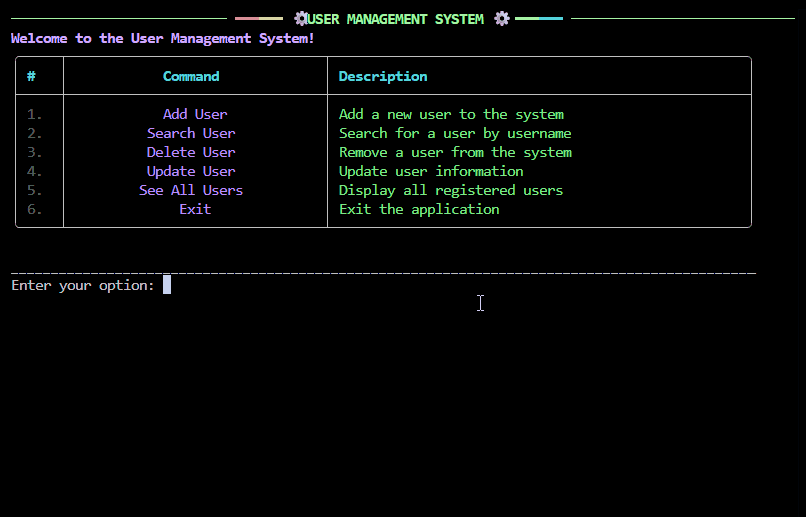

# 👥 User Management System (CLI)
[](https://www.python.org/)
[](https://github.com/ahmedfakhar747/User-Management-System/commits/main)
[](https://github.com/ahmedfakhar747/User-Management-System/stargazers)
[](https://github.com/ahmedfakhar747/User-Management-System/network/members)

🚀 A beginner-friendly **Python CLI** to manage users with validation, persistence, and a polished **Rich-powered** UI.



---

## ⚡ Quick Start

```bash
git clone https://github.com/ahmedfakhar747/User-Management-System
cd User-Management-System
pip install -r requirements.txt
python src/ums/main.py
````

---

## 🎯 Why This Project?

Practice clean architecture, CLI design, data persistence, and validation.
Perfect for Python learners or anyone building CLI tools.

---

## ✨ Features

➕ Add / 🔍 Search / ✏️ Update / 🗑️ Delete / 👁️ View users
💾 JSON persistence, 🎨 Rich CLI, ✅ Validation

---

## 📚 Learn More

* Full workflow & operation GIFs → [USAGE.md](USAGE.md)
* Folder Structure & Architecture → [ARCHITECTURE.md](ARCHITECTURE.md)
* Testing → [TESTS.md](TESTS.md)

---