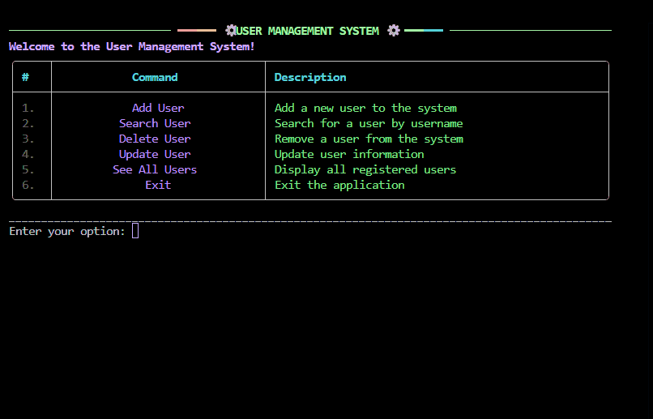
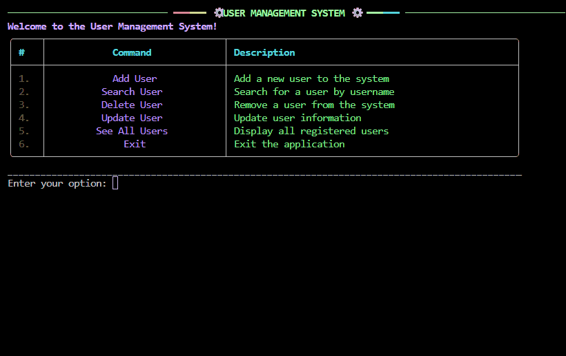
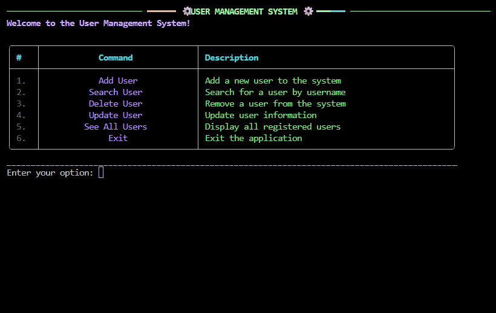
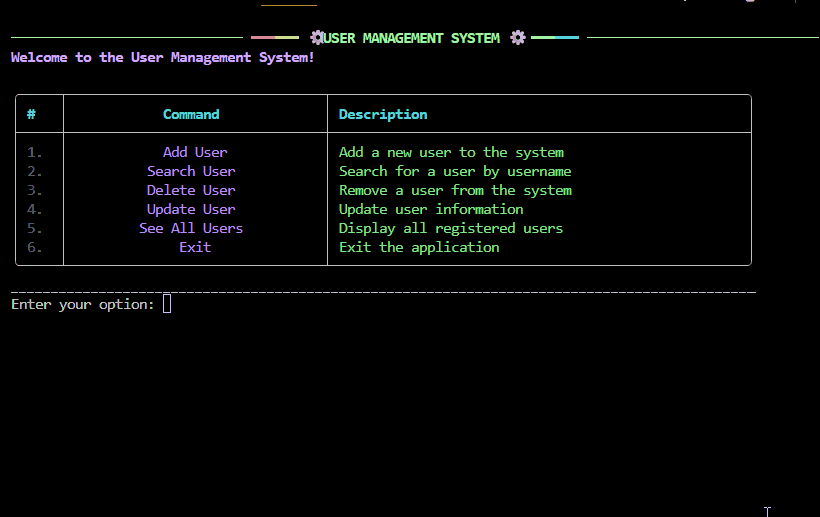

# 📖 Usage Examples

### Add User


### Search User


### Update User


### Delete User


### View All Users


---

### Example Workflow

1. Run CLI:
```bash
python src/ums/main.py
````

2. Add user, search, update, delete, etc.

---
